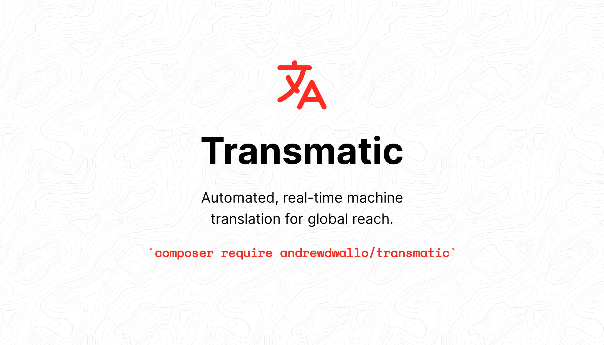

<p align="center">
    <a href="https://laravel.com"></a>
    <a href="https://php.net"></a>
    <a href="https://packagist.org/packages/andrewdwallo/transmatic"></a>
    <a href="https://packagist.org/packages/andrewdwallo/transmatic"></a>
</p>

Transmatic is a Laravel package for real-time machine translation, enabling instant and dynamic translation across your entire application. Suitable for projects ranging from simple websites to complex SaaS platforms and more, Transmatic offers customization and flexibility. Using advanced machine translation, it makes your app globally accessible. While [AWS Translate](https://aws.amazon.com/translate/) is the default engine, the package can easily integrate with other translation services.

## Common Use Cases

### ⚡️ Application Auto-Translation

With this package, developers can automatically translate their entire application to multiple languages using services like AWS Translate. Say goodbye to manually specifying translations for each language and achieve a multilingual platform in minutes.

#### Benefits
- **Speed** - Translate your application in minutes.
- **Auto Locale Management** - The package manages and updates the source locale translations based on the provided text.

### 👤 Personalized User Experience

Empower users to customize their experience by selecting their preferred language. Once selected, the application dynamically adjusts its locale.

#### Benefits
- **Enhanced User Experience** - Interact in the user's native language.
- **Real-Time Translation** - Adapt instantly to the user's language selection.

### 🏢 SaaS Tenant-Specific Translations

Optimize the experience for SaaS businesses by offering tenant-specific translations. Each tenant can view their dashboard in their desired language.

#### Benefits
- **Personalization** - Address each tenant's language choice.
- **Engagement Boost** - Increase interaction by presenting content in the tenant's chosen language.

### 🛍️ E-Commerce for a Global Audience

Position your e-commerce platform or global marketplace for worldwide reach. Offer product descriptions, reviews, and more in numerous languages.

#### Benefits
- **Global Reach** - Cater to a global audience.
- **Enhanced Sales** - Improve conversion rates by engaging customers in their native language.

## Installation

Start by installing the package via Composer:

```bash
composer require andrewdwallo/transmatic
```

After the package is installed, run the following command:

```bash
php artisan transmatic:install
```

## Setting Up Transmatic

### AWS Translate Integration

By default, the package leverages [AWS Translate](https://aws.amazon.com/translate/). Ensure you've set the necessary configurations as specified in the [AWS Service Provider for Laravel](https://github.com/aws/aws-sdk-php-laravel) documentation, and have the following environment variables:

```dotenv
AWS_ACCESS_KEY_ID=your-access-key-id
AWS_SECRET_ACCESS_KEY=your-secret-access-key
AWS_REGION=your-region  # default is us-east-1
```
These are essential for the AWS SDK to authenticate and interact with AWS services. Once these are set, you don't need to do anything else for AWS Translate to work.

### Custom Translation Service Integration

While AWS Translate is the default, Transmatic allows integration with other translation services. For integration, create a class that adheres to the `Wallo\Transmatic\Contracts\Translator` contract and update the `transmatic.php` config file accordingly.

### Configuration Overview

Several configuration options are available, including setting the source locale, defining translation storage methods (cache or JSON files), and specifying batch processing behavior. Refer to the `config/transmatic.php` file for a comprehensive look.

## Using Transmatic

### Basic & Advanced Usage

The `translate` method provides an easy way to translate a single string of text. You can specify the target locale as an optional argument. If not specified, the application's current locale will be used.

```php
use Wallo\Transmatic\Facades\Transmatic;

$translatedText = Transmatic::translate('Hello World', 'es'); // Hola Mundo
```
This method also updates the translations in your Source Locale based on the text passed in, ensuring that new strings are stored for future use.

### Translating Multiple Strings

For translating multiple strings at once, use the `translateMany` method. This method accepts an array of strings to translate, as well as an optional target locale. If not specified, the application's current locale will be used.

```php
use Wallo\Transmatic\Facades\Transmatic;

$texts = ['Hello World', 'Goodbye World'];

$translatedTexts = Transmatic::translateMany($texts, 'fr'); // ['Bonjour le monde', 'Au revoir le monde']
```
Like the `translate` method, this method will also update the translations in your Source Locale based on the text passed in.

### Fetching Supported Locales

To retrieve a list of supported locales, use the `getSupportedLocales` method. This method will return an array of locales supported by your application. For example, if in your specified file path for storing translations you have a `fr.json` file, this method will return `['en', 'fr']`.

```php
use Wallo\Transmatic\Facades\Transmatic;

$supportedLocales = Transmatic::getSupportedLocales(); // ['en', 'fr']
```

### Fetching Supported Languages

To retrieve a list of supported languages along with their corresponding locales, use the `getSupportedLanguages` method. This method returns an associative array where the key is the locale and the value is the displayable name of the language. You can also pass a display locale as an optional parameter to get the language names in a specific language. If no display locale is specified, the application's current locale is used.

```php
use Wallo\Transmatic\Facades\Transmatic;

$supportedLanguages = Transmatic::getSupportedLanguages();
// Output: ['en' => 'English', 'fr' => 'French']

$supportedLanguages = Transmatic::getSupportedLanguages('fr');
// Output: ['en' => 'Anglais', 'fr' => 'Français']
```

### Getting Language from Locale

You can get the displayable name of a language from a locale using the `getLanguage` method. This method takes in the locale you're interested in and an optional display locale parameter. If no display locale is specified, it defaults to the application's current locale.

```php
use Wallo\Transmatic\Facades\Transmatic;

$language = Transmatic::getLanguage('de'); 
// Output: 'Deutsch'

$language = Transmatic::getLanguage('de', 'en'); 
// Output: 'German'
```

### Global Helper

For quick and easy translations, you may use the `translate()` and `translateMany()` helper functions.
```php
$translatedText = translate('Hello World', 'es'); // Hola Mundo

$translatedTexts = translateMany(['Hello World', 'Goodbye World'], 'fr'); // ['Bonjour le monde', 'Au revoir le monde']
```

### Behind the Scenes

#### Managing Translations

When you call the `translate` or `translateMany` methods, Transmatic will first check to see if the translation already exists in your application's source locale. If it does, it will process and return the translations for the specified target locale. If not, it will update your source locale's translations with the new text, and then continue with the translation process.

Transmatic checks if a batch translation process is running for the target locale you specify. If a batch is running, the package fetches the translations from either cache or JSON language files, depending on your configuration.

#### New vs. Existing Translations

For new target locales, Transmatic initiates a queued batch translation process managed by the underlying `TranslateService` class. This allows the package to efficiently handle large volumes of text for translation in one go, thanks to a queuing mechanism.

For existing target locales where most translations are already in place, the `dispatchSync` method is used for immediate, synchronous translation.

#### Importance of a Robust Source Locale

To make the most out of the batch processing feature for new target locales, it's recommended to have a well-populated source locale language file. While the code ensures that the source locale is up-to-date before proceeding with translations, having a robust set of translations in the source locale maximizes the efficiency of the batch processing for new languages.

## Changelog

Please see [CHANGELOG](CHANGELOG.md) for more information on what has changed recently.

## Contributing

Please see [CONTRIBUTING](CONTRIBUTING.md) for details.

## Security Vulnerabilities

Please review [our security policy](../../security/policy) on how to report security vulnerabilities.

## Credits

- [Andrew Wallo](https://github.com/andrewdwallo)
- [All Contributors](../../contributors)

## License

The MIT License (MIT). Please see [License File](LICENSE.md) for more information.
